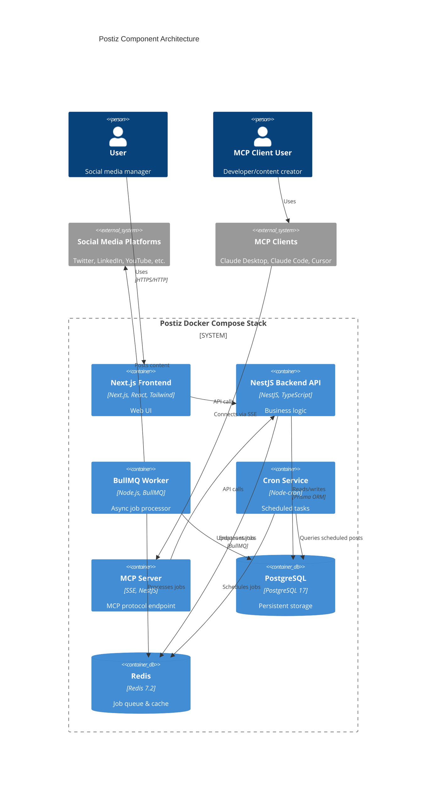

# Components

## Postiz Frontend (Next.js)

**Responsibility:** Serves the web-based admin interface for managing social media accounts, creating posts, viewing analytics, and configuring settings.

**Key Interfaces:**

- HTTP requests to NestJS Backend API
- Static asset serving
- OAuth redirect handling

**Dependencies:**

- NestJS Backend API
- Browser environment

**Technology Stack:** Next.js 14, Tailwind CSS, React Context + Zustand

## Postiz Backend API (NestJS)

**Responsibility:** Core business logic layer handling post management, OAuth token management, platform API orchestration, user authentication, and MCP server endpoint.

**Key Interfaces:**

- RESTful HTTP API endpoints
- SSE endpoint for MCP clients
- OAuth callback endpoints
- Prisma ORM queries to PostgreSQL
- BullMQ job queue enqueuing

**Dependencies:**

- PostgreSQL database
- Redis for BullMQ
- Platform-specific OAuth libraries

**Technology Stack:** NestJS 10, Prisma 5, Passport.js, BullMQ

## BullMQ Worker

**Responsibility:** Processes asynchronous background jobs from Redis queue. Handles post publishing to platform APIs, analytics fetching, OAuth token refresh.

**Key Interfaces:**

- Consumes jobs from Redis/BullMQ queue
- HTTP requests to social media platform APIs
- Updates PostgreSQL records

**Dependencies:**

- Redis
- PostgreSQL
- Platform API credentials

**Technology Stack:** BullMQ 5, Platform API clients

## Cron Service

**Responsibility:** Executes recurring tasks: triggering scheduled posts, periodically fetching analytics, refreshing expiring OAuth tokens.

**Key Interfaces:**

- Enqueues BullMQ jobs
- Queries PostgreSQL for scheduled posts

**Dependencies:**

- PostgreSQL
- Redis/BullMQ

**Technology Stack:** Node-cron

## PostgreSQL Database

**Responsibility:** Persistent storage for all application data: users, integrations, posts, analytics, API keys.

**Key Interfaces:**

- Prisma ORM connections
- TCP port 5432
- pg_dump for backups

**Technology Stack:** PostgreSQL 17 Alpine

## Redis Cache & Queue

**Responsibility:** In-memory data structure store for BullMQ job queue and caching layer.

**Key Interfaces:**

- Redis protocol (TCP port 6379)
- BullMQ client connections

**Technology Stack:** Redis 7.2

## MCP Server Endpoint

**Responsibility:** Exposes Postiz functionality to Model Context Protocol clients. Translates natural language commands into Postiz API calls.

**Key Interfaces:**

- SSE endpoint: `GET /api/mcp/{apiKey}/sse`
- Validates API keys
- Emits events: post_created, post_published, post_failed

**Dependencies:**

- Backend API
- PostgreSQL for API key validation

**Technology Stack:** Server-Sent Events, NestJS EventEmitter

## Component Interaction Diagram

---
