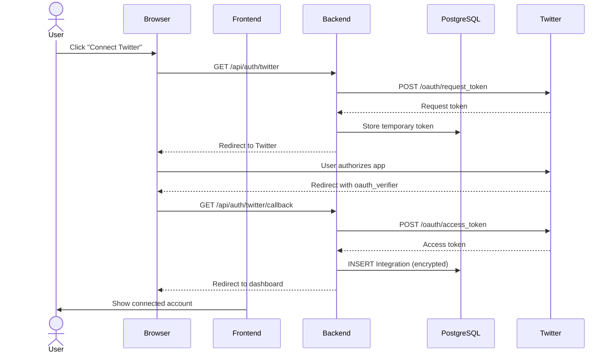
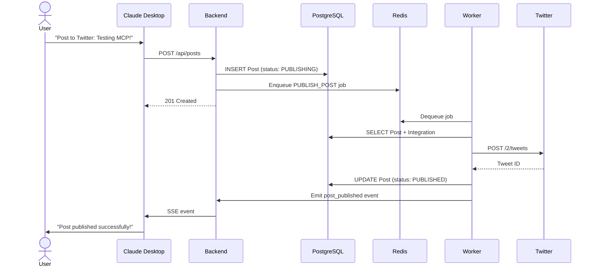
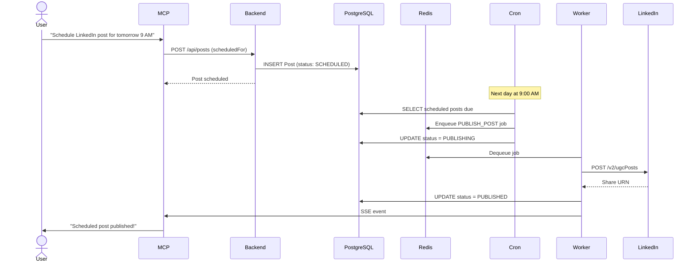

# Core Workflows

## OAuth Platform Connection (Twitter Example)

```mermaid
sequenceDiagram
    actor User
    participant Browser
    participant Frontend
    participant Backend
    participant DB as PostgreSQL
    participant Twitter

    User->>Browser: Click "Connect Twitter"
    Browser->>Backend: GET /api/auth/twitter
    Backend->>Twitter: POST /oauth/request_token
    Twitter-->>Backend: Request token
    Backend->>DB: Store temporary token
    Backend-->>Browser: Redirect to Twitter
    Browser->>Twitter: User authorizes app
    Twitter-->>Browser: Redirect with oauth_verifier
    Browser->>Backend: GET /api/auth/twitter/callback
    Backend->>Twitter: POST /oauth/access_token
    Twitter-->>Backend: Access token
    Backend->>DB: INSERT Integration (encrypted)
    Backend-->>Browser: Redirect to dashboard
    Frontend->>User: Show connected account
```

## Create and Publish Post via MCP

```mermaid
sequenceDiagram
    actor User
    participant MCP as Claude Desktop
    participant Backend
    participant DB as PostgreSQL
    participant Redis
    participant Worker
    participant Twitter

    User->>MCP: "Post to Twitter: Testing MCP!"
    MCP->>Backend: POST /api/posts
    Backend->>DB: INSERT Post (status: PUBLISHING)
    Backend->>Redis: Enqueue PUBLISH_POST job
    Backend-->>MCP: 201 Created

    Worker->>Redis: Dequeue job
    Worker->>DB: SELECT Post + Integration
    Worker->>Twitter: POST /2/tweets
    Twitter-->>Worker: Tweet ID
    Worker->>DB: UPDATE Post (status: PUBLISHED)
    Worker->>Backend: Emit post_published event
    Backend->>MCP: SSE event
    MCP->>User: "Post published successfully!"
```

## Schedule Post for Future

```mermaid
sequenceDiagram
    actor User
    participant MCP
    participant Backend
    participant DB as PostgreSQL
    participant Redis
    participant Cron
    participant Worker
    participant LinkedIn

    User->>MCP: "Schedule LinkedIn post for tomorrow 9 AM"
    MCP->>Backend: POST /api/posts (scheduledFor)
    Backend->>DB: INSERT Post (status: SCHEDULED)
    Backend-->>MCP: Post scheduled

    Note over Cron: Next day at 9:00 AM

    Cron->>DB: SELECT scheduled posts due
    Cron->>Redis: Enqueue PUBLISH_POST job
    Cron->>DB: UPDATE status = PUBLISHING

    Worker->>Redis: Dequeue job
    Worker->>LinkedIn: POST /v2/ugcPosts
    LinkedIn-->>Worker: Share URN
    Worker->>DB: UPDATE status = PUBLISHED
    Worker->>MCP: SSE event
    MCP->>User: "Scheduled post published!"
```

---
