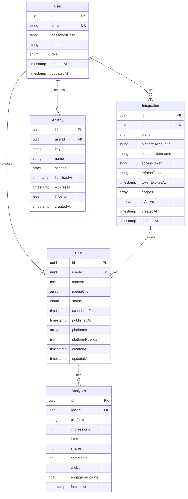

# Data Models

## User

**Purpose:** Represents admin/user accounts that manage the Postiz instance. Created during initial setup, owns social media connections and posts.

**Key Attributes:**

- `id`: UUID - Unique identifier
- `email`: string - Login email address
- `passwordHash`: string - Bcrypt hashed password
- `name`: string - Display name
- `role`: enum (ADMIN, USER) - Permission level
- `createdAt`: timestamp - Account creation date
- `updatedAt`: timestamp - Last modification date

**TypeScript Interface:**

```typescript
interface User {
  id: string;
  email: string;
  passwordHash: string;
  name: string;
  role: 'ADMIN' | 'USER';
  createdAt: Date;
  updatedAt: Date;
}
```

**Relationships:**

- One-to-many with `Integration` (owns multiple social media connections)
- One-to-many with `Post` (creates multiple posts)
- One-to-many with `ApiKey` (generates multiple MCP API keys)

## Integration

**Purpose:** Represents connected social media accounts via OAuth. Each platform connection (Twitter, LinkedIn, YouTube, etc.) is an Integration entity.

**Key Attributes:**

- `id`: UUID - Unique identifier
- `userId`: UUID - Foreign key to User
- `platform`: enum - Platform type (TWITTER, LINKEDIN, YOUTUBE, FACEBOOK, INSTAGRAM, etc.)
- `platformAccountId`: string - Platform's user/page ID
- `platformUsername`: string - Display name/handle on platform
- `accessToken`: string (encrypted) - OAuth access token
- `refreshToken`: string (encrypted) - OAuth refresh token (if applicable)
- `tokenExpiresAt`: timestamp - Token expiration time
- `scopes`: string[] - Granted OAuth scopes
- `isActive`: boolean - Connection status
- `createdAt`: timestamp - Connection date
- `updatedAt`: timestamp - Last token refresh

**TypeScript Interface:**

```typescript
interface Integration {
  id: string;
  userId: string;
  platform: 'TWITTER' | 'LINKEDIN' | 'YOUTUBE' | 'FACEBOOK' | 'INSTAGRAM' | 'TIKTOK' | 'REDDIT' | 'PINTEREST' | 'THREADS' | 'MASTODON' | 'DISCORD' | 'SLACK';
  platformAccountId: string;
  platformUsername: string;
  accessToken: string; // Encrypted in database
  refreshToken?: string; // Encrypted, optional
  tokenExpiresAt?: Date;
  scopes: string[];
  isActive: boolean;
  createdAt: Date;
  updatedAt: Date;
}
```

**Relationships:**

- Many-to-one with `User`
- One-to-many with `Post`

## Post

**Purpose:** Core entity representing social media content. Supports drafts, scheduled posts, and published posts. Can target single or multiple platforms simultaneously.

**Key Attributes:**

- `id`: UUID - Unique identifier
- `userId`: UUID - Foreign key to User
- `content`: text - Post text content
- `mediaUrls`: string[] - Attached images/videos
- `status`: enum - POST_STATUS (DRAFT, SCHEDULED, PUBLISHING, PUBLISHED, FAILED)
- `scheduledFor`: timestamp (nullable) - When to publish
- `publishedAt`: timestamp (nullable) - Actual publication time
- `platforms`: string[] - Target platform IDs
- `platformPostIds`: JSON - Map of platform to published post ID
- `createdAt`: timestamp - Creation date
- `updatedAt`: timestamp - Last modification

**TypeScript Interface:**

```typescript
interface Post {
  id: string;
  userId: string;
  content: string;
  mediaUrls: string[];
  status: 'DRAFT' | 'SCHEDULED' | 'PUBLISHING' | 'PUBLISHED' | 'FAILED';
  scheduledFor?: Date;
  publishedAt?: Date;
  platforms: string[];
  platformPostIds: Record<string, string>;
  errorMessage?: string;
  createdAt: Date;
  updatedAt: Date;
}
```

**Relationships:**

- Many-to-one with `User`
- Many-to-many with `Integration`
- One-to-many with `Analytics`

## Analytics

**Purpose:** Stores engagement metrics for published posts. Periodically updated by Postiz workers fetching data from platform APIs.

**Key Attributes:**

- `id`: UUID - Unique identifier
- `postId`: UUID - Foreign key to Post
- `platform`: enum - Which platform these metrics are from
- `impressions`: integer - View count
- `likes`: integer - Like/favorite count
- `shares`: integer - Retweet/share count
- `comments`: integer - Reply/comment count
- `clicks`: integer - Link click count
- `engagementRate`: float - Calculated engagement percentage
- `fetchedAt`: timestamp - When metrics were last updated

**TypeScript Interface:**

```typescript
interface Analytics {
  id: string;
  postId: string;
  platform: string;
  impressions: number;
  likes: number;
  shares: number;
  comments: number;
  clicks: number;
  engagementRate: number;
  fetchedAt: Date;
}
```

**Relationships:**

- Many-to-one with `Post`

## ApiKey

**Purpose:** Represents generated API keys for MCP server authentication. Created in Postiz UI, used by Claude Desktop/Code/Cursor.

**Key Attributes:**

- `id`: UUID - Unique identifier
- `userId`: UUID - Foreign key to User
- `key`: string - API key (format: `ptz_xxxxx...`, hashed in database)
- `name`: string - Human-readable key name
- `scopes`: string[] - Permissions (posts:write, posts:read, analytics:read)
- `lastUsedAt`: timestamp (nullable) - Last API request timestamp
- `expiresAt`: timestamp (nullable) - Optional expiration
- `isActive`: boolean - Key enabled status
- `createdAt`: timestamp - Generation date

**TypeScript Interface:**

```typescript
interface ApiKey {
  id: string;
  userId: string;
  key: string; // Hashed in database
  name: string;
  scopes: ('posts:write' | 'posts:read' | 'analytics:read')[];
  lastUsedAt?: Date;
  expiresAt?: Date;
  isActive: boolean;
  createdAt: Date;
}
```

**Relationships:**

- Many-to-one with `User`

## Entity Relationship Diagram



---
